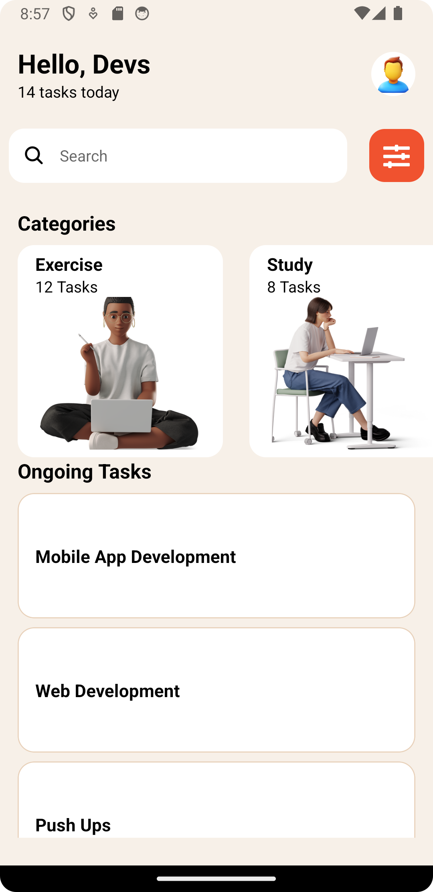
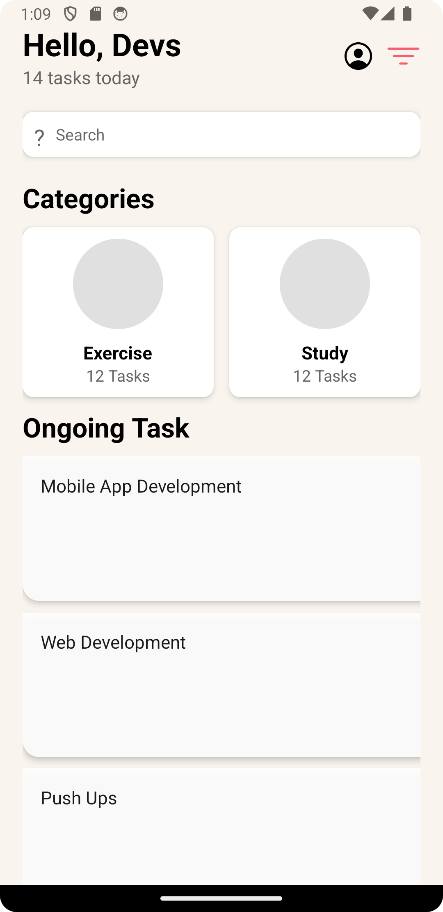

STUDENT ID: 11115682

This project is a task management app built with React Native. The app includes core components such as View, Text, FlatList, Image, TextInput, and Button. It showcases different task categories and a list of ongoing tasks, styled to provide a clean and user-friendly experience.

Components
1. App
Description: The main entry point of the application. It sets up the overall layout and integrates all other components.
Usage: Initializes the Header, SearchBar, CategoryList, and TaskList components, and provides sample data for categories and tasks.
2. Header
Description: Displays the header section of the app.
Usage: Includes an Image placeholder for the profile picture and sets the greeting message and subtitle. Positioned at the top of the screen.
3. SearchBar
Description: Allows users to search through tasks.
Usage: Includes a TextInput field for entering search queries and an icon for indicating search functionality. Positioned below the header.
4. Category
Description: Represents an individual category item.
Usage: Displays a category name, task count, and an image. Used within the CategoryList component.
5. CategoryList
Description: Displays a list of task categories.
Usage: Uses FlatList to render a horizontal scrollable list of Category components. Positioned below the search bar.
6. TaskList
Description: Displays a list of ongoing tasks.
Usage: Uses FlatList to render a vertical list of tasks. Each task is displayed with its title and styled to match the design. Positioned below the category list.

SCREENSHOTS

